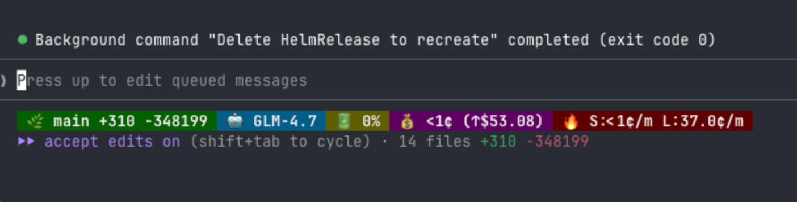

# Claude Code Statusline

A custom statusline for Claude Code with cost tracking, burn rate monitoring, and git integration.


## Features

- **Cost Tracking** - Real-time session cost from Claude Code API (no hardcoded pricing)
- **Lifetime Stats** - Tracks total spending across all sessions
- **Burn Rate** - Shows cost per minute (session and lifetime average)
- **Git Integration** - Displays current branch with insertions/deletions
- **Context Usage** - Shows context window percentage

## Preview



## Installation

1. Download the script:

```bash
curl -o ~/.claude/statusline.sh https://raw.githubusercontent.com/nguyenvanduocit/claude-statusline/main/statusline.sh
chmod +x ~/.claude/statusline.sh
```

2. Add to your `~/.claude/settings.json`:

```json
{
  "statusLine": {
    "type": "command",
    "command": "~/.claude/statusline.sh"
  }
}
```

3. Restart Claude Code

## Data Files

The statusline creates these files in `~/.claude/`:

- `lifetime-cost.json` - Tracks total cost across all sessions
- `session-timing.json` - Tracks session start times for burn rate calculation

To reset stats:

```bash
rm ~/.claude/lifetime-cost.json ~/.claude/session-timing.json
```

## Dependencies

- `jq` - JSON processor
- `bc` - Calculator
- `git` - For branch/diff info

## License

MIT
