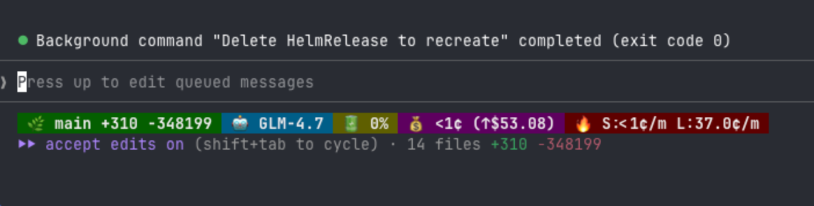

# Claude Code Statusline

A custom statusline for Claude Code with cost tracking, burn rate monitoring, token usage, and git integration.


## Features

- **Token Tracking** - Shows cumulative input/output tokens for the session
- **Agent Token Tracking** - Tracks tokens used by sub-agents (Task tool)
- **Cost Tracking** - Real-time session cost from Claude Code API
- **Lifetime Stats** - Tracks total spending across all sessions
- **Burn Rate** - Shows cost per minute (session and lifetime average)
- **Git Integration** - Displays current branch with insertions/deletions
- **Context Usage** - Shows context window percentage

## Preview



**Display format:**
```
🌿 main +10 -5  🤖 Opus 4.5  🧠 28% (↑53k ↓8k ⚡56k 🤖19k)  💰 S:$2.02 L:$1731  🔥 S:18¢/m L:33¢/m
```

- `↑` Input tokens (cumulative)
- `↓` Output tokens (cumulative)
- `⚡` Cache read tokens
- `🤖` Sub-agent tokens (from Task tool)

## Installation

### 1. Download the statusline script

```bash
curl -o ~/.claude/statusline.sh https://raw.githubusercontent.com/nguyenvanduocit/claude-statusline/main/statusline.sh
chmod +x ~/.claude/statusline.sh
```

### 2. (Optional) Enable sub-agent token tracking

Download the hook script:

```bash
mkdir -p ~/.claude/hooks
curl -o ~/.claude/hooks/track-agent-tokens.sh https://raw.githubusercontent.com/nguyenvanduocit/claude-statusline/main/hooks/track-agent-tokens.sh
chmod +x ~/.claude/hooks/track-agent-tokens.sh
```

### 3. Update settings.json

Add to your `~/.claude/settings.json`:

```json
{
  "statusLine": {
    "type": "command",
    "command": "~/.claude/statusline.sh"
  },
  "hooks": {
    "PostToolUse": [
      {
        "matcher": "Task",
        "hooks": [
          {
            "type": "command",
            "command": "$HOME/.claude/hooks/track-agent-tokens.sh"
          }
        ]
      }
    ]
  }
}
```

If you only want the statusline without agent tracking, skip the hooks section.

### 4. Restart Claude Code

## Data Files

The statusline creates these files in `~/.claude/`:

| File | Description |
|------|-------------|
| `lifetime-cost.json` | Total cost across all sessions |
| `session-timing.json` | Session start times for burn rate |
| `agent-tokens.json` | Sub-agent token counts per session |

To reset all stats:

```bash
rm ~/.claude/lifetime-cost.json ~/.claude/session-timing.json ~/.claude/agent-tokens.json
```

## Dependencies

- `jq` - JSON processor
- `bc` - Calculator
- `git` - For branch/diff info

## License

MIT
